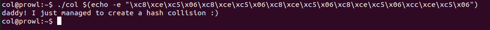

# Collision

Source code :

```C
#include <stdio.h>
#include <string.h>
unsigned long hashcode = 0x21DD09EC;
unsigned long check_password(const char* p){
        int* ip = (int*)p;
        int i;
        int res=0;
        for(i=0; i<5; i++){
                res += ip[i];
        }
        return res;
}

int main(int argc, char* argv[]){
        if(argc<2){
                printf("usage : %s [passcode]\n", argv[0]);
                return 0;
        }
        if(strlen(argv[1]) != 20){
                printf("passcode length should be 20 bytes\n");
                return 0;
        }

        if(hashcode == check_password( argv[1] )){
                system("/bin/cat flag");
                return 0;
        }
        else
                printf("wrong passcode.\n");
        return 0;
}
```

Challenge contraints:

1. Length of the passcode should be 20 bytes (line number 19)
2. After the magic done in the function `check_password` the returned value should be equal to `hashcode(hex: 0x21DD09EC, int: 568134124)` (line number 24)

The first constraint is not a problem, however, to solve the second contraint we will have to take a look at the `check_password` function and understand exactly what is it doing.


`check_password` function source code:

```c
unsigned long check_password(const char* p){
        int* ip = (int*)p;
        int i;
        int res=0;
        for(i=0; i<5; i++){
                res += ip[i];
        }
        return res;
}
```

Function input: `const char* p` and the value passed while calling is the `argv[1]` i.e. a user controlled value.

In the line number 2 (`check_password`) the parameter of `const char*` has been casted to `int*`, this is an important thing to notice as this will change how we will interpret the code that follows.

The `for loop` on line 5-7 iterates over the `int*` casted parameter and stores the sum of 5 values pointed by the pointer into a variable called `res`

> **NOTE**: `++ operator` on a `char*` pointer increments the value of the pointer by `1 byte` and by `4 bytes` if the pointer is of type `int*`

This means we have to provide 5 integers in `argv[1]` whose sum equals the value of `hashcode (568134124)`

```python
Python 3.7.3 (default, Apr  3 2019, 05:39:12) 
[GCC 8.3.0] on linux
Type "help", "copyright", "credits" or "license" for more information.
>>> 568134124/5 # Diving the value of hashcode by 5 to get 4 whole integers
113626824.8
>>> 568134124 - (4*113626824) # Getting the remaining value to complete the sum
113626828
```

After getting the 5 values we’ll have to send this within `20 bytes` of data, as evident now the number of bytes if we send this as text will be greater than 20 bytes, this can only be achieved if we send data as in `hexadecimal values` and packed in `little endian` format as follows:

```python
Python 3.7.3 (default, Apr  3 2019, 05:39:12) 
[GCC 8.3.0] on linux
Type "help", "copyright", "credits" or "license" for more information.
>>> import struct
>>> struct.pack("<I", 113626824)
b'\xc8\xce\xc5\x06' # This set of bytes is to be repeated 4 times
>>> struct.pack("<I", 113626828)
b'\xcc\xce\xc5\x06' # This set of bytes are to be sent just once
```

Once we have all the `little endian` packed bytes we can create our payload which will bypass the `check_password if condition` on line 24 (`main`)

Final Payload:

```
\xc8\xce\xc5\x06\xc8\xce\xc5\x06\xc8\xce\xc5\x06\xc8\xce\xc5\x06\xcc\xce\xc5\x06
```

Run the payload using follwing command

```bash
col@prowl:~$ ./col $(echo -e "\xc8\xce\xc5\x06\xc8\xce\xc5\x06\xc8\xce\xc5\x06\xc8\xce\xc5\x06\xcc\xce\xc5\x06")
daddy! I just managed to create a hash collision :) ## FLAG VALUE
```

