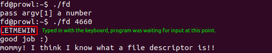

# fd

There are 2 things that we need to achieve in this challenge to get the flag. 

- Make `read` function get input from `stdin` (Standard input)
- Successfully pass the `if condition` with `LETMEWIN` string in `buf`

`read` function in line 3 is dependent upon the variable `fd (Line 1)` which is user-controlled by the value of `argv[1]`

Our target is `fd = 0` (0 - Standard Input File Descriptor [stuff we type using our keyboards]). If we are able to get `fd = 0,` we will be able to store the value `"LETMEWIN"` into the `buf` and successfully pass the `strcmp` function and get the flag.

```C
int fd = atoi( argv[1] ) - 0x1234;
int len = 0;
len = read(fd, buf, 32);
if(!strcmp("LETMEWIN\n", buf)){
	printf("good job :)\n");
	system("/bin/cat flag");
	exit(0);
}
```

Converting the hex value of `0x1234` to integer we get `4660`. 

```python
# To get integer value from a hex value
python -c 'print int("1234", 16)'
```

Now we have the integer value that if passed to the program, will make it wait for user input, which will be stored into the `buf` variable for `strcmp`.


